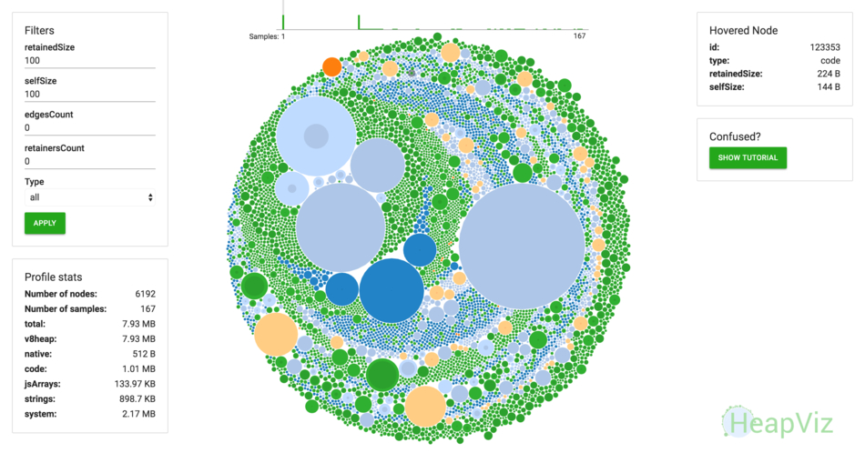

HeapViz is a Chrome heap profile visualization tool. It helps to diagnose memory leaks, memory allocation issues, and large in-memory objects.

You can find a hosted version at [heapviz.com](https://heapviz.com).

## Usage

1.  Generate a [heap allocation profile](https://developers.google.com/web/tools/chrome-devtools/memory-problems/allocation-profiler)
2.  Upload your profile to heapviz, either at heapviz.com or locally
3.  Wait for the profile to parse and render. This can take some time, especially for large profiles.
4.  Step through your profile with arrow keys. Click and drag the timeline to create a selection region. Click on individual circles for detailed information about edges and retainers.

For a detailed walkthrough both of the development of HeapViz and a quick guide on using the tool, see my six part article series.

1.  [Intuition Engineering and the Chrome Heap Profile](https://hackernoon.com/a-tale-of-javascript-performance-61c282f89f2a)
2.  [Choosing a Visualization Method](https://hackernoon.com/a-tale-of-javascript-performance-6011615523e8)
3.  [Renderers in all Shapes and Sizes](https://medium.com/@tomlagier/a-tale-of-javascript-performance-8c4036f479a8)
4.  [Working with Workers for a Jank-Free UI](https://medium.com/@tomlagier/a-tale-of-javascript-performance-bc372e465201)
5.  [Screamin' Speed With WebAssembly](https://hackernoon.com/screamin-speed-with-webassembly-b30fac90cd92)
6.  [Introducing HeapViz](https://medium.com/@tomlagier/a-new-way-to-debug-memory-issues-with-web-apps-4e29df964af2)

## Building

To build and run HeapViz yourself:

1.  Clone the repo
2.  Ensure you have `node` and `yarn` (or `npm`) installed
3.  `yarn`
4.  `yarn start`

For a production build, use `yarn build`.

Included is also a [Dockerfile](scripts/Dockerfile) if you prefer that

HeapViz was created with [Create React App](https://github.com/facebook/create-react-app), check out those docs for some hints on directory structure.

## Architecture

HeapViz has a few moving parts

1.  [React](https://reactjs.org/) frontend, [Redux](https://redux.js.org/) store, [Redux-Observable](https://redux-observable.js.org/) for side-effects.
2.  [Webpack 1.4](https://webpack.js.org/) build system
3.  [TypeScript](https://www.typescriptlang.org/) for types
4.  The heap profile parsing is done in a worker (`src/services/worker`) with the profile parsing code forked from [Chromium](https://www.chromium.org/Home) - the source has since moved on, but you can get a sense of what it looks like in context [here](https://cs.chromium.org/chromium/src/third_party/blink/renderer/devtools/front_end/heap_snapshot_worker/HeapSnapshot.js?q=HeapSnapshot&sq=package:chromium&l=33)
5.  We also do our circle layout in the worker. I've transcribed [d3-heirarchy's](https://github.com/d3/d3-hierarchy) circle packing algorithm [to C++](https://github.com/tomlagier/circle-pack) and compiled it to WebAssembly (see `public/pack-circles`).
6.  One of the biggest performance wins would be to incorporate the [feedback by doom_Oo7](https://www.reddit.com/r/programming/comments/6kyjsr/screamin_fast_webapps_with_webassembly/djq84qp/) to refine the circle packing algorithm.
7.  We could also hook up the [WebAssembly loader](https://github.com/ballercat/wasm-loader) to save some bytes in the WebAssembly loading (currently using emscripten's default loading code which is pretty weighty
    )
8.  Rendering is done by `src/services/renderer`, using [StackGL](http://stack.gl/) packages to wrap WebGL primitives. As [noted in this tweet](https://twitter.com/DoctorGester/status/976937143972061185), there is a quick win to be had in the rendering pipeline.
9.  I'm pretty proud of my object picking code - see `src/services/renderer/picker.ts`. I basically create a second rendering, except each circle in this rendering is a unique color. I then hold a map of these unique colors to their respective nodes and use gl.readPixels to look up the appropriate node.
10. We do some really basic caching of each render to ensure that we don't have to re-layout whenever we have the same set of filtered nodes. This is a big performance win but majorly spikes memory usage, especially when stepping through large memory profiles. Having a way to disable the cache would be a good idea.

## Licensing

HeapViz is released under the Apache license. I'd appreciate attribution if you use it out in the wild.

## Contributing

PR's welcome, I'd love to work with people to turn this into a really useful tool.

## To-Do

* [ ] Travis build
* [ ] Circle-pack improvements
* [ ] Rendering improvements
* [ ] Move parsing, layout, and rendering to separate packages
* [ ] Clean up - there are a few extra files and dependencies that need to be purged
* [ ] Write some tests
* [ ] Find more intuitive ways to filter to more easily expose problem objects

## Donation

If you're really awesome and think I should keep doing this with my spare time, feel free to throw me a few bucks on [Patreon](https://www.patreon.com/bePatron?c=1697158) or if you prefer crypto, I'm at

* BTC: 38Le1nkuYWeM24zUi1doCKdgVmJdSA9TbL
* ETH: 0x441C6BEEf42A5506FC7bb1Cec28c31370f69Ba19
* BCH: qqa8777f0w5fl2vhuf4cdwjn66slwtm00vrzmzxhuf
